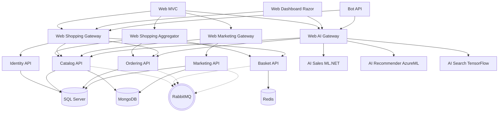

# eShopOnContainersAI Services Catalog

Tài liệu này mô tả danh sách các dịch vụ (services), thành phần cơ sở hạ tầng, các API Gateways và mối quan hệ (dependencies) giữa chúng trong hệ thống eShopOnContainersAI, được trích xuất từ cấu hình `docker-compose.yml`.

## 1. Hạ tầng và Lưu trữ (Infrastructure & Data Stores)

Các dịch vụ cung cấp nền tảng lưu trữ dữ liệu và message broker cho hệ thống.

* **sql.data**: Cơ sở dữ liệu SQL Server (`microsoft/mssql-server-linux`).
* **nosql.data**: Cơ sở dữ liệu MongoDB (`mongo`).
* **basket.data**: Dịch vụ Redis Cache (`redis:alpine`).
* **rabbitmq**: Message broker RabbitMQ để giao tiếp bất đồng bộ giữa các dịch vụ (`rabbitmq:3-management-alpine`).

## 2. Core Microservices (Các dịch vụ cốt lõi)

Các dịch vụ nghiệp vụ chính của hệ thống.

* **identity.api**: Dịch vụ xác thực và phân quyền.
  * *Phụ thuộc vào*: `sql.data`
* **basket.api**: Dịch vụ giỏ hàng.
  * *Phụ thuộc vào*: `basket.data`, `identity.api`, `rabbitmq`
* **catalog.api**: Dịch vụ quản lý danh mục sản phẩm.
  * *Phụ thuộc vào*: `sql.data`, `nosql.data`, `rabbitmq`
* **ordering.api**: Dịch vụ quản lý đơn hàng.
  * *Phụ thuộc vào*: `sql.data`, `rabbitmq`
* **ordering.backgroundtasks**: Dịch vụ xử lý tác vụ ngầm liên quan đến đơn hàng.
  * *Phụ thuộc vào*: `sql.data`, `rabbitmq`
* **marketing.api**: Dịch vụ tiếp thị.
  * *Phụ thuộc vào*: `sql.data`, `nosql.data`, `identity.api`, `rabbitmq`
* **payment.api**: Dịch vụ thanh toán giả lập.
  * *Phụ thuộc vào*: `rabbitmq`
* **locations.api**: Dịch vụ quản lý vị trí.
  * *Phụ thuộc vào*: `nosql.data`, `rabbitmq`
* **ordering.signalrhub**: Dịch vụ đẩy thông báo thời gian thực liên quan đến đơn hàng.
  * *Phụ thuộc vào*: `nosql.data`, `sql.data`, `identity.api`, `rabbitmq`, `ordering.api`, `marketing.api`, `catalog.api`, `basket.api`

## 3. AI Microservices (Các dịch vụ AI)

Các dịch vụ cung cấp khả năng AI (Trí tuệ nhân tạo) như dự đoán, gợi ý và tìm kiếm bằng hình ảnh.

* **ai.salesforecasting.mlnet.api**: Dịch vụ dự báo bán hàng (sử dụng ML.NET).
* **ai.productrecommender.azureml.api**: Dịch vụ gợi ý sản phẩm (sử dụng Azure ML).
* **ai.productsearchimagebased.tensorflow.api**: Dịch vụ tìm kiếm sản phẩm qua hình ảnh (sử dụng TensorFlow).
* **ai.productsearchimagebased.azurecognitiveservices.api**: Dịch vụ tìm kiếm sản phẩm qua hình ảnh (sử dụng Azure Cognitive Services).

## 4. API Gateways & Aggregators

Lớp trung gian đóng vai trò điểm vào cho các ứng dụng client (Frontend), điều phối và tổng hợp yêu cầu đến các microservices nội bộ.

* **mobileshoppingapigw**: API Gateway cho ứng dụng Mobile Shopping.
  * *Phụ thuộc vào*: Các core APIs, data stores và AI image search APIs.
* **mobilemarketingapigw**: API Gateway cho Mobile Marketing.
  * *Phụ thuộc vào*: Các core APIs, `locations.api`.
* **webshoppingapigw**: API Gateway cho ứng dụng Web Shopping.
  * *Phụ thuộc vào*: Hầu hết các core APIs.
* **webmarketingapigw**: API Gateway cho Web Marketing.
  * *Phụ thuộc vào*: Hầu hết các core APIs.
* **webaiapigw**: API Gateway điều phối các yêu cầu đến các AI Microservices.
  * *Phụ thuộc vào*: `ai.salesforecasting.mlnet.api`, `ai.productrecommender.azureml.api`, các AI image search APIs, `catalog.api`, `ordering.api`.
* **mobileshoppingagg**: Aggregator (BFF) dành cho Mobile Shopping, tổng hợp dữ liệu từ nhiều microservices.
  * *Phụ thuộc vào*: Hầu hết các core APIs.
* **webshoppingagg**: Aggregator (BFF) dành cho Web Shopping.
  * *Phụ thuộc vào*: Hầu hết các core APIs.

## 5. Web, Mobile & Bot (Frontend Clients)

Các ứng dụng mà người dùng cuối hoặc hệ thống bên ngoài tương tác trực tiếp.

* **bot.api**: Dịch vụ xử lý chatbot.
  * *Phụ thuộc vào*: `webshoppingapigw`, `webaiapigw`
* **webraz**: Ứng dụng Web Dashboard quản lý (Razor Pages).
  * *Phụ thuộc vào*: `webshoppingapigw`, `webaiapigw`
* **webmvc**: Ứng dụng Web mua sắm chính (MVC).
  * *Phụ thuộc vào*: `webshoppingagg`, `webshoppingapigw`, `webmarketingapigw`, `webaiapigw`

## 6. Sơ đồ các mối quan hệ tổng quan

Dưới đây là sơ đồ Mermaid đơn giản hóa luồng giao tiếp giữa các thành phần tiêu biểu:

*Lưu ý: Sơ đồ trên đã được đơn giản hóa để hiển thị các luồng chính. `docker-compose.yml` chứa các định nghĩa phụ thuộc đầy đủ và phức tạp hơn giữa các Gateway và tất cả các Dịch vụ.*
